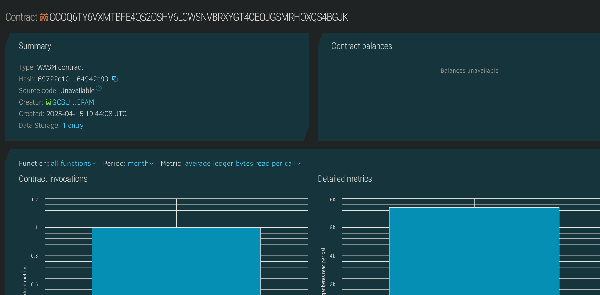

# Crypto Payment Checkout

## Project Title
Crypto Payment Checkout - A decentralized payment processing system built on Stellar's Soroban smart contract platform.

## Project Description
Crypto Payment Checkout is a blockchain-based payment processing system that enables seamless and secure cryptocurrency transactions between customers and merchants. Built on Stellar's Soroban platform, this decentralized application (dApp) eliminates the need for traditional payment processors while providing transparency, security, and reduced transaction fees.

The system allows merchants to create payment requests that customers can fulfill using cryptocurrency. All transactions are recorded on the blockchain, ensuring immutability and traceability. The smart contract manages the entire payment lifecycle, from creation to completion, with options for refunds and cancellations.

By leveraging blockchain technology, Crypto Payment Checkout provides a trustless environment where neither merchants nor customers need to rely on third-party payment processors, resulting in lower fees, faster settlements, and enhanced security.

## Project Vision
The vision for Crypto Payment Checkout is to revolutionize digital commerce by providing a decentralized alternative to traditional payment processing systems. We aim to:

1. Eliminate intermediaries in the payment process, reducing costs for both merchants and customers
2. Provide instant settlement of transactions, improving cash flow for businesses
3. Create a borderless payment system accessible to anyone with an internet connection
4. Enhance transaction security through blockchain's immutable ledger
5. Offer transparent fee structures with significantly lower costs than traditional payment processors
6. Enable global commerce without the restrictions of traditional banking systems
7. Bridge the gap between cryptocurrency adoption and everyday commerce

By achieving these objectives, Crypto Payment Checkout will serve as a catalyst for broader cryptocurrency adoption in everyday transactions, helping to integrate blockchain technology into the mainstream economy.

## Key Features

### Current Features:
- **Decentralized Payment Processing**: Direct peer-to-peer transactions without intermediaries
- **Transparent Transaction Records**: All payment details stored immutably on the blockchain
- **Payment Lifecycle Management**: Complete system for creating, tracking, and completing payments
- **Merchant Analytics**: Basic tracking of merchant payment volume and transaction count
- **Low Transaction Fees**: Minimal costs compared to traditional payment processors
- **Fast Settlement**: Near-instant payment confirmation and settlement
- **Secure Transactions**: Cryptographically secure payment processing
- **Payment Descriptions**: Ability to include detailed information with each transaction

### Technical Implementation:
- Built on Stellar's Soroban smart contract platform
- Written in Rust for performance and security
- Stateful contract design for maintaining payment records
- Structured data storage for efficient retrieval and management
- Address-based authentication for secure access control

## Future Scope

### Short-term Roadmap:
- **Multi-Currency Support**: Accept various cryptocurrencies and stablecoins
- **Payment Splitting**: Distribute payments to multiple recipients
- **Recurring Payments**: Implement subscription-based payment models
- **Escrow Services**: Hold funds in escrow until predefined conditions are met
- **Refund Processing**: Streamlined process for returning funds to customers
- **Merchant Dashboard**: Web interface for managing payments and analytics
- **Mobile Integration**: APIs for mobile app integration
- **Payment Links**: Shareable payment links for easier customer checkout

### Long-term Vision:
- **Cross-Chain Compatibility**: Expand to other blockchain ecosystems
- **Payment Dispute Resolution**: Decentralized arbitration for disputed transactions
- **Invoicing System**: Complete invoicing functionality with payment tracking
- **Dynamic Pricing**: Support for currency conversion and price adjustments
- **Advanced Analytics**: Comprehensive reporting and business intelligence tools
- **Loyalty Programs**: Reward systems for repeat customers
- **Regulatory Compliance Tools**: Features to assist with KYC/AML requirements
- **Integration Marketplace**: Plugins for popular e-commerce platforms
- **Point-of-Sale System**: Physical retail payment solutions
- **Merchant Reputation System**: Trust indicators based on transaction history
- **Smart Contracts for Complex Transactions**: Programmable payment logic for specific business needs

## Contract Details:
CCOQ6TY6VXMTBFE4QS2OSHV6LCWSNVBRXYGT4CEOJGSMRHOXQS4BGJKI
